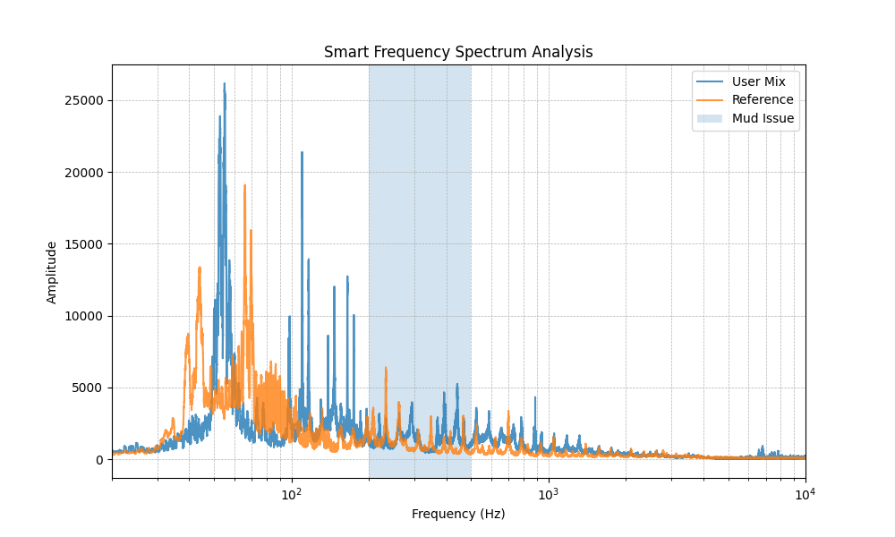

# 🎧 AI Mixing Assistant (V2.0)

## 🧠 Overview

AI-powered application that analyzes your mix by comparing it with a reference track and provides intelligent, human-readable feedback.

Now upgraded with a **real user interface**, making it easy for producers to upload tracks, analyze mixes, and visualize results instantly.

This project focuses on **explainable mix diagnostics** — not auto-mixing — helping users understand *why* their mix sounds off and *how to fix it*.

---

## 🚀 What’s New in V2.0

* 🎛️ Interactive UI using Streamlit
* 📂 Drag & drop audio upload
* ⚡ One-click mix analysis
* 📊 Real-time spectrum visualization
* 🧠 Clean formatted analysis report

---

## 🚀 Features

* 🎚️ Mix vs Reference comparison
* 📊 Frequency-based issue detection
* 📉 Confidence & severity scoring
* 💡 Actionable suggestions
* 🎛️ Smoothed + log-scale spectrum visualization
* 🎯 Smart problem zone highlighting
* 📊 Multi-band scoring system
* 🧠 Overall mix score
* 🔥 Reference match percentage
* 🎧 Masking detection (kick/bass & vocal regions)
* 🌐 Interactive web interface

---

## 🧠 How It Works

1. Upload your mix (`user.wav`)
2. Upload reference track (`ref.wav`)
3. Click **Analyze Mix**
4. System:

   * Normalizes audio
   * Performs frequency analysis
   * Detects issues & masking
   * Calculates scores
   * Generates insights
   * Displays spectrum graph

---

## 📊 Sample Output

### 🎧 Analysis Report

* Low-Mid issue: Muddiness (200–500 Hz)
  *(Confidence: 18.8% | Severity: Mild)*

---

### 📊 Mix Scores

* Low-End Score: 91.0/100
* Low-Mid Score: 61.2/100
* Presence Score: 99.4/100

**Overall Mix Score: 83.9/100**
**Reference Match: 83.9%**

---

### 📈 Spectrum Visualization



---

## 🛠️ Tech Stack

* Python
* Streamlit
* Librosa
* NumPy
* Matplotlib

---

## ▶️ How to Run

### 1. Activate environment

```bash id="runv20a"
venv\Scripts\activate
```

### 2. Install dependencies

```bash id="runv20b"
pip install -r requirements.txt
```

*(or manually install: streamlit, librosa, numpy, matplotlib)*

### 3. Run app

```bash id="runv20c"
streamlit run src/app.py
```

---

## 📁 Output

* `data/output/report.txt` → Analysis report
* `data/output/spectrum.png` → Spectrum visualization

---

## 📌 Version

**V2.0 — UI Integration (Streamlit App)**

---

## 🎯 Vision

To build an **AI-powered mix mentor** that helps producers understand and improve their mixes through clear, contextual, and actionable feedback.

---

## 🚀 Future Scope

* 🎛️ Plugin-style UI (DAW-like design)
* 🎚️ Real-time audio processing
* 🤖 Advanced AI recommendations
* 🌍 Web deployment
* 📈 Track-level analysis (stems)

---
